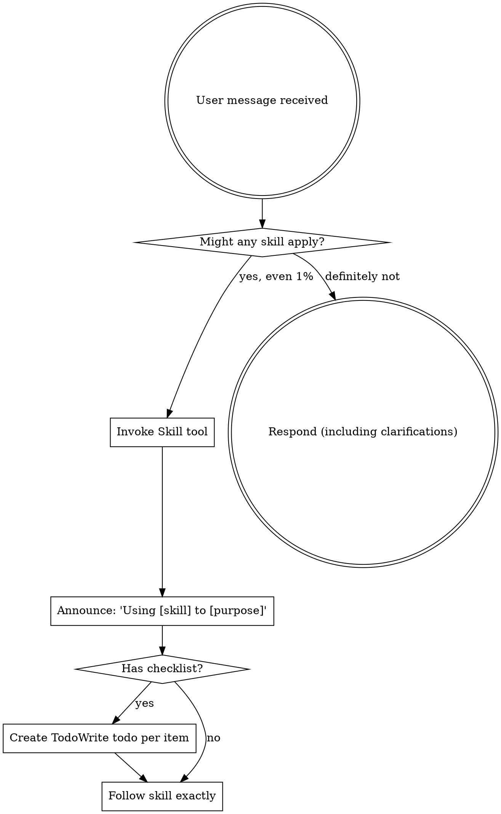

使用中文回答和显示思考过程。给我的回复要清晰易懂

<EXTREMELY_IMPORTANT>
If you think there is even a 1% chance a skill might apply to what you are doing, you ABSOLUTELY MUST invoke the skill.

IF A SKILL APPLIES TO YOUR TASK, YOU DO NOT HAVE A CHOICE. YOU MUST USE IT.

This is not negotiable. This is not optional. You cannot rationalize your way out of this.
</EXTREMELY_IMPORTANT>

Software Engineering Protocol

Decision Priority
1) Correctness & invariants
2) Simplicity (KISS > DRY)
3) Testability / verifiability
4) Maintainability (low coupling, high cohesion)
5) Performance (measure first)

Working Loop
Clarify → Map impact (topology) → Plan minimal diff → Implement → Validate → Refactor (only related) → Report

Stop & Ask When
- Requirements are ambiguous/conflicting
- Public API / data contract / dependency direction must change
- The change triggers cross-module ripple (shotgun surgery risk)
- Security/privacy risk exists
- No credible validation path exists

Change Rules
- Minimal diff; no unrelated churn (refactor/rename/format/deps).
- Names use domain language; comments explain WHY (constraints/trade-offs).
- One abstraction level per function; single-purpose responsibilities.
- Patterns/abstractions only with a clear change scenario; prefer composition over inheritance.
- Think in models/data-structures before code; handle failures explicitly (no silent errors).

Verification Guardrail
- Changes to logic/data/behavior must be verifiable (tests preferred).
- UI/presentation-only changes may skip tests.
- If tests are skipped, state verification steps + residual risk.
- Untested code is “legacy”: add seams/isolate dependencies before behavior changes.

Anti-Patterns
- Premature optimization
- Abstraction before 3rd use
- Swallowing errors / silent failures
- Hidden coupling / unclear ownership across modules

uv Commands (Python)
- Create/refresh venv: `uv venv .venv`
- Install deps from pyproject: `uv pip install -e .`
- Run commands in env: `uv run python -m pytest`, `uv run ruff check .`, `uv run mypy .`
- Run scripts/tools: `uv run python path/to/script.py`
